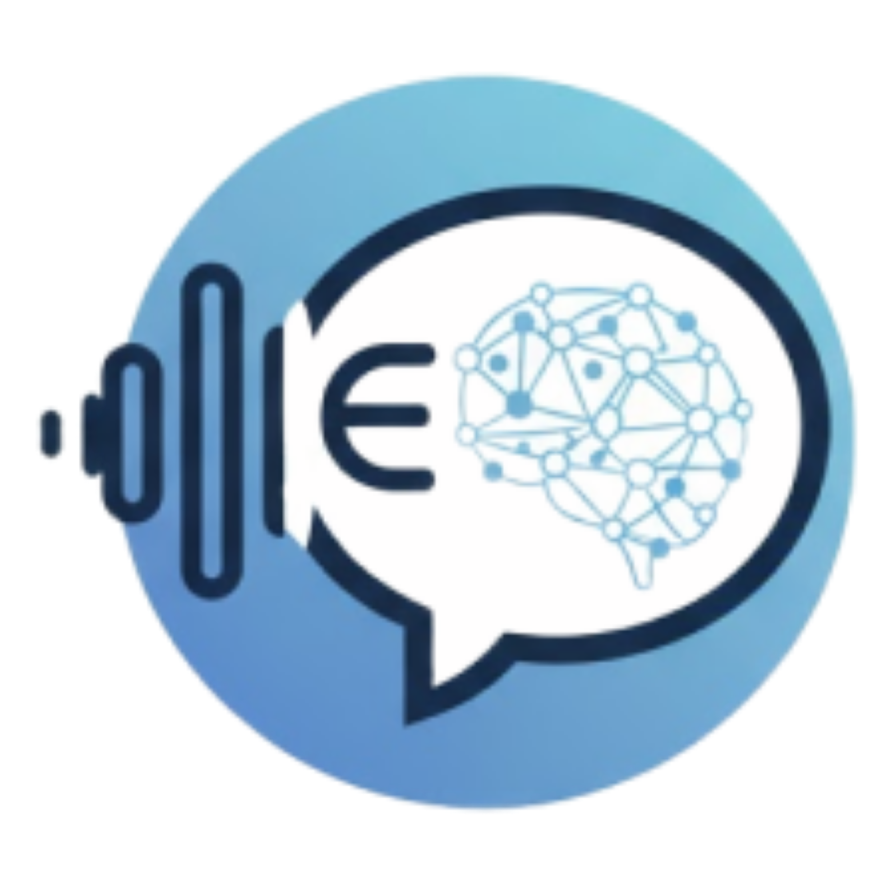

<p align="center">
  
</p>

<h1 align="center">Echozy</h1>

<p align="center">
  A web-based multilingual Augmentative and Alternative Communication platform for stroke patients.
</p>

Echozy is a web-based multilingual Augmentative and Alternative Communication (AAC) platform designed to support stroke patients with communication impairments. The system helps patients express their needs, emotions, and daily messages through visual phrase and vocabulary cards, message building, and text-to-speech output.

Echozy also supports caregivers and healthcare providers by allowing them to manage patient profiles, customize communication content, monitor session activity, and track communication practice progress. An admin module is included to manage default phrases and vocabulary that can be shared across patients.

---

## Project Overview

Stroke patients who experience speech or communication difficulties may struggle to express basic needs, emotions, and daily messages. Echozy provides a simple, accessible, and multilingual communication platform that allows patients to communicate using touch-based visual cards.

The system is designed with a patient-friendly interface, bilingual support, role-based access, and communication tracking features. Echozy aims to support both daily communication and rehabilitation-related practice.

---

## Key Features

### 1. Patient Communication Board

The Echozy Board allows patients to select phrase and vocabulary cards to build a message.

Main functions include:

* Visual phrase and vocabulary cards
* Message builder
* Backspace and clear message buttons
* Speak button for text-to-speech output
* Category-based card organization
* English and Bahasa Melayu text support
* Adjustable card size for accessibility
* Usage tracking when cards are selected

---

### 2. Phrases and Vocabulary Module

This module displays all available patient communication cards.

It includes:

* Phrase cards and vocabulary cards
* Category filtering
* Bilingual card text
* Visual image support for each card
* Card click tracking
* Text-to-speech support for selected cards
* Merged content from admin default content and patient-specific content

Phrase categories include:

* Urgent Needs
* Basic Responses
* Feelings & Emotions
* Physical Condition
* Daily Needs
* People & Social Communication
* Rehabilitation
* Activities & Preferences

Vocabulary categories include:

* People
* Food & Drink
* Places
* Body & Health
* Feelings
* Actions & Verbs

---

### 3. Frequently Used Module

The Frequently Used module displays the patient’s most selected phrases and vocabulary.

It helps caregivers and healthcare providers understand which communication cards are most important to the patient.

Main functions include:

* Frequently used phrase cards
* Frequently used vocabulary cards
* Click count tracking
* Category-based filtering
* Card usage ranking
* Text-to-speech playback
* Personalized communication insights

---

### 4. Practice Dashboard

The Practice Dashboard supports rehabilitation and communication practice.

Main functions include:

* Phrase practice tracking
* Vocabulary practice tracking
* Successful and unsuccessful practice status
* Practice progress percentage
* Progress bar visualization
* Practice click tracking
* Category-based practice cards
* Bilingual text support
* Text-to-speech support

Practice results are stored and used to update patient progress analytics.

---

### 5. Patient Dashboard

The Patient Dashboard provides an overview of an individual patient’s communication activity.

It includes:

* Patient profile details
* Patient status
* Total sessions
* Frequently used count
* Total phrases
* Total vocabulary
* Last session record
* Frequently used table
* Phrase progress
* Vocabulary progress
* Edit patient details
* Delete patient record
* Enter session button
* Links to manage phrases and vocabulary

---

### 6. Caregiver and Healthcare Provider Dashboard

Caregivers and healthcare providers can access a dashboard to manage patients and monitor session activity.

Main functions include:

* Total patients summary
* Total sessions summary
* Detailed activity log
* Patient session entry and quit time
* Session duration calculation
* Role-based dashboard text
* Navigation to patient dashboard
* Settings page based on user role

---

### 7. Manage Patients

The Manage Patients module allows caregivers and healthcare providers to add and view patient records.

Main functions include:

* Add new patient
* Store patient name, ID, age, gender, date of birth, language, and status
* Auto-calculate age from date of birth
* Display patient cards
* Navigate to individual patient dashboard
* Patient avatar based on gender

---

### 8. Manage Phrases

Caregivers and healthcare providers can manage personalized phrases for a selected patient.

Main functions include:

* Add phrase
* Edit phrase
* Delete phrase
* Auto-generate phrase ID
* English phrase text
* Bahasa Melayu phrase text
* Upload phrase image
* Organize phrases by category
* Merge admin default phrases with patient-specific phrases

Only patient-specific phrases can be edited or deleted by caregivers or healthcare providers. Admin default phrases remain shared global content.

---

### 9. Manage Vocabulary

Caregivers and healthcare providers can manage personalized vocabulary for a selected patient.

Main functions include:

* Add vocabulary
* Edit vocabulary
* Delete vocabulary
* Auto-generate vocabulary ID
* English vocabulary text
* Bahasa Melayu vocabulary text
* Upload vocabulary image
* Organize vocabulary by category
* Merge admin default vocabulary with patient-specific vocabulary

Only patient-specific vocabulary can be edited or deleted by caregivers or healthcare providers.

---

### 10. Admin Dashboard

The admin dashboard is used to manage global default content for Echozy.

Admin can:

* Manage default phrases
* Manage default vocabulary
* Add, edit, and delete global content
* Provide default content that can be shared across all patients

Admin content is separate from patient-specific caregiver or healthcare provider content.

Default admin login:

```text
Email: admin@echozy.com
Password: admin123
```

---

### 11. Admin Manage Phrases

The Admin Manage Phrases module controls the default phrase content shared across patients.

Main functions include:

* Add default phrase
* Edit default phrase
* Delete default phrase
* Auto-generate phrase ID
* English and Bahasa Melayu phrase text
* Upload phrase image
* Organize phrases by category
* Store global phrase content under admin storage

---

### 12. Admin Manage Vocabulary

The Admin Manage Vocabulary module controls the default vocabulary content shared across patients.

Main functions include:

* Add default vocabulary
* Edit default vocabulary
* Delete default vocabulary
* Auto-generate vocabulary ID
* English and Bahasa Melayu vocabulary text
* Upload vocabulary image
* Organize vocabulary by category
* Store global vocabulary content under admin storage

---

## User Roles

Echozy supports four main user roles.

### Patient

Patients use the communication board, phrases and vocabulary cards, frequently used cards, and practice dashboard during communication sessions.

### Caregiver

Caregivers can:

* Sign up and sign in
* Add and manage patients
* Customize patient phrases and vocabulary
* Enter patient communication sessions
* View patient progress and activity
* Update caregiver settings

### Healthcare Provider

Healthcare providers can:

* Sign up and sign in
* Manage assigned patients
* Monitor communication activity
* View rehabilitation-related progress
* Manage patient phrases and vocabulary
* Update professional profile settings

### Admin

Admin can:

* Sign in through admin access
* Manage default global phrases
* Manage default global vocabulary
* Control content that can be shared across all patients

---

## Text-to-Speech Integration

Echozy currently supports online text-to-speech using an OpenAI TTS backend server.

The backend uses:

* Node.js
* Express.js
* OpenAI API
* `gpt-4o-mini-tts` model
* MP3 audio response

The `/api/tts` endpoint receives text and language from the frontend, generates speech using OpenAI, and returns an audio file to be played in the browser.

Supported language handling:

```text
English: en-US
Bahasa Melayu: ms-MY
```

For Bahasa Melayu, the TTS instruction uses a clear and natural Malaysian Malay tone. For English, it uses a clear and patient-friendly English tone.

---

## Offline TTS Fallback

Echozy is planned to support offline-friendly speech output using the browser’s built-in `SpeechSynthesis` API.

This fallback is useful when the OpenAI TTS service is unavailable or when the user has limited internet access.

However, browser SpeechSynthesis has limitations:

* Voice availability depends on the user’s device
* Bahasa Melayu voice may not be available on all devices
* Voice quality may vary by browser and operating system
* Some browsers may require internet access for certain voices

---

## Data Storage

The current prototype mainly uses browser `localStorage` to store and manage system data.

Stored data includes:

```text
echozySession
echozyUsers
echozyPatients
echozyPhrases
echozyVocabulary
echozyAdminPhrases
echozyAdminVocabulary
echozyUsageCounts
echozyPracticeResults
echozyPracticeClickCounts
echozySessionLogs
echozyCaregiverSettings
echozyProviderSettings
```

### Current Prototype Storage

In the current implementation, data is stored locally in the browser. This allows the system prototype to demonstrate core features such as:

* User sign up and sign in
* Patient management
* Phrase and vocabulary management
* Usage tracking
* Practice tracking
* Session logging
* Admin default content management

### Planned Database and Hosting

For deployment, Echozy is planned to use Supabase for:

* Authentication
* Database storage
* Hosting
* User role management
* Patient records
* Phrase and vocabulary records
* Usage logs
* Practice results
* Session logs

Supabase will replace the current localStorage-based prototype storage to support persistent, centralized, and multi-user data access.

---

## Technology Stack

### Frontend

* HTML
* CSS
* JavaScript

### Backend

* Node.js
* Express.js

### Text-to-Speech

* OpenAI Text-to-Speech API
* Browser SpeechSynthesis fallback

### Database and Hosting

* Current prototype: Browser localStorage
* Planned deployment: Supabase

### Other Tools

* GitHub for version control
* Visual Studio Code for development

---

## Project Folder Structure

Example structure:

```text
Echozy/
│
├── index.html
├── server.js
├── package.json
├── .env
├── .gitignore
│
├── assets/
│   ├── css/
│   │   └── style.css
│   │
│   ├── js/
│   │   ├── auth-flow.js
│   │   ├── dashboard-flow.js
│   │   ├── manage-patients.js
│   │   ├── manage-phrases.js
│   │   ├── manage-vocabulary.js
│   │   ├── patient-dashboard.js
│   │   ├── board.js
│   │   ├── phrases-vocabulary.js
│   │   ├── frequently-used.js
│   │   ├── practice-dashboard.js
│   │   ├── settings-caregiver.js
│   │   ├── settings-provider.js
│   │   ├── admin-manage-phrases.js
│   │   └── admin-manage-vocabulary.js
│   │
│   └── images/
│       ├── logo.png
│       ├── avatars/
│       ├── placeholders/
│       ├── homepage/
│       └── about/
│
└── lib/
    ├── about.html
    ├── choose-role.html
    │
    ├── auth/
    │   ├── caregiver-signin.html
    │   ├── caregiver-signup.html
    │   ├── provider-signin.html
    │   ├── provider-signup.html
    │   └── admin-signin.html
    │
    ├── main/
    │   ├── dashboard.html
    │   ├── manage-patients.html
    │   ├── patient-dashboard.html
    │   ├── manage-phrases.html
    │   ├── manage-vocabulary.html
    │   ├── settings-caregiver.html
    │   └── settings-provider.html
    │
    ├── patients/
    │   ├── board.html
    │   ├── phrases-vocabulary.html
    │   ├── frequently-used.html
    │   └── practice-dashboard.html
    │
    └── admin/
        ├── admin-dashboard.html
        ├── admin-manage-phrases.html
        └── admin-manage-vocabulary.html
```

---

## Installation and Setup

### 1. Clone the Repository

```bash
git clone https://github.com/your-username/echozy.git
```

### 2. Open the Project Folder

```bash
cd echozy
```

### 3. Install Dependencies

```bash
npm install
```

### 4. Create Environment File

Create a `.env` file in the root folder.

```text
OPENAI_API_KEY=your_openai_api_key_here
PORT=3000
```

Make sure `.env` is included in `.gitignore` so the API key is not pushed to GitHub.

---

## Running the Project

### 1. Start the TTS Server

```bash
node server.js
```

If successful, the terminal should show:

```text
TTS server running on http://localhost:3000
```

### 2. Open the Web Application

Open `index.html` in the browser, or use a local server extension such as Live Server in Visual Studio Code.

Recommended:

```text
Right click index.html → Open with Live Server
```

---

## Important Notes

### OpenAI API Key

The OpenAI API key must be stored in the `.env` file.

Do not expose the API key inside frontend JavaScript files.

Correct:

```text
.env
OPENAI_API_KEY=your_key_here
```

Incorrect:

```javascript
const apiKey = "your_key_here";
```

---

### TTS Server URL

The frontend currently calls the local TTS server using:

```javascript
http://localhost:3000/tts
```

If the backend route is `/api/tts`, make sure the frontend fetch URL matches the backend route.

For example:

```javascript
fetch('http://localhost:3000/api/tts')
```

---

### LocalStorage Limitation

Because the current prototype uses localStorage, data is stored only in the same browser and device.

This means:

* Data will not sync across different devices
* Clearing browser storage will remove the data
* Multiple users do not share the same database yet
* Supabase integration is required for real deployment

---

## How to Use Echozy

### Caregiver or Healthcare Provider Flow

1. Open Echozy homepage.
2. Click **Sign In**.
3. Choose either **Caregiver** or **Healthcare Provider**.
4. Sign up or sign in.
5. Add or view patients.
6. Open a patient dashboard.
7. Manage patient phrases and vocabulary.
8. Enter the patient communication session.
9. Use the Echozy Board, Phrases & Vocabulary, Frequently Used, and Practice Dashboard.

### Patient Session Flow

1. Open a patient dashboard.
2. Click **Enter Session**.
3. Use the Echozy Board as the main communication page.
4. Tap phrase or vocabulary cards.
5. Build a message.
6. Click **Speak** to generate speech.
7. Use Frequently Used to access common patient expressions.
8. Use Practice Dashboard to mark communication practice progress.
9. Click **Quit Session** to return to the patient dashboard.

### Admin Flow

1. Open admin sign in page.
2. Sign in using admin credentials.
3. Open Admin Dashboard.
4. Manage default phrases.
5. Manage default vocabulary.
6. Add, edit, or delete global content.

---

## Future Improvements

Planned future improvements include:

* Supabase authentication integration
* Supabase database integration
* Supabase hosting deployment
* Replacing localStorage with centralized database tables
* Offline-first support using Progressive Web App features
* Improved browser SpeechSynthesis fallback
* Malay voice improvement for offline mode
* Patient-specific role access control
* More detailed usage analytics
* Exportable patient progress reports
* User testing with caregivers and healthcare professionals
* Accessibility testing for stroke patients with limited motor control

---

## Project Purpose

This project was developed as a Final Year Project to support stroke patients who have difficulty speaking. Echozy aims to provide a simple, accessible, multilingual, and patient-centered AAC platform that helps improve communication between patients, caregivers, family members, and healthcare providers.

---

## Developer

Developed by:

```text
Fatin Farhanah Binti Halidin
Faculty of Computer Science and Information Technology
Universiti Malaysia Sarawak (UNIMAS)
Software Engineering Programme
```

---

## Acknowledgement

This project is developed as part of a Final Year Project under the Faculty of Computer Science and Information Technology, Universiti Malaysia Sarawak (UNIMAS).
